<div align="center">


<h1>RAG Reference Architecture Platform</h1>

<p><strong>The Strategic Architecture for Enterprise-Grade Retrieval-Augmented Generation Systems.</strong></p>

[]()
[]()
[]()

<br/>

> **"Context is the bridge to intelligence."** 
> **RAG Reference Architecture** is an enterprise-grade platform designed to demonstrate the building blocks of scalable, secure, and production-ready Retrieval-Augmented Generation (RAG). It provides the blueprint for document ingestion pipelines, vector search optimization, and LLM integration patterns that ensure accuracy and factual grounding.

</div>

---

## 🏛️ Executive Summary

While Large Language Models (LLMs) are powerful, their knowledge is static and they are prone to hallucinations. Organizations often fail to deploy AI safely because they lack the structured retrieval mechanisms required to ground LLMs in dynamic, authoritative enterprise data, leading to inaccurate outputs and data leakage risks.

This platform provides the **RAG Intelligence Control Plane**. It implements a complete **Retrieval Intelligence Framework**, enabling AI Architects and ML Engineers to manage the RAG lifecycle as a first-class citizen. By automating semantic chunking and orchestrating multi-modal ingestion, we ensure that every AI interaction is contextually aware, factually grounded, and protected with enterprise-grade security guardrails.

---

## 📐 Architecture Storytelling: Principal Reference Models

### 1. Principal Architecture: Global RAG Intelligence & Semantic Retrieval Plane
This diagram illustrates the end-to-end flow from multi-modal document ingestion to vector embedding, semantic retrieval, context-aware prompt assembly, and grounded generation.

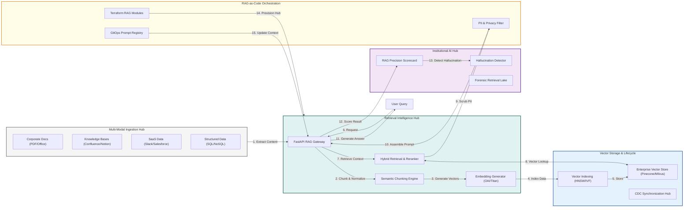

### 2. The RAG Lifecycle Management Flow
The continuous path of enterprise knowledge from initial ingestion and embedding to retrieval-augmented generation and auditing.

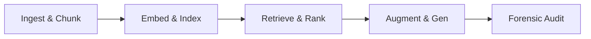

### 3. Multi-Modal Ingestion Hub
Standardizing the extraction and normalization of data across PDFs, Wikis, SaaS apps, and databases for high-fidelity indexing.

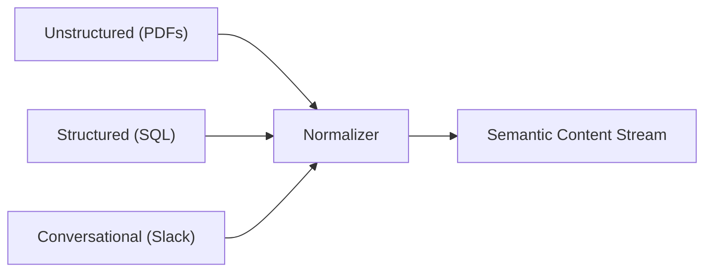

### 4. Semantic Retrieval & Ranking Engine
Combining high-speed vector search with Cross-encoder re-ranking to ensure the most relevant context is delivered to the LLM.

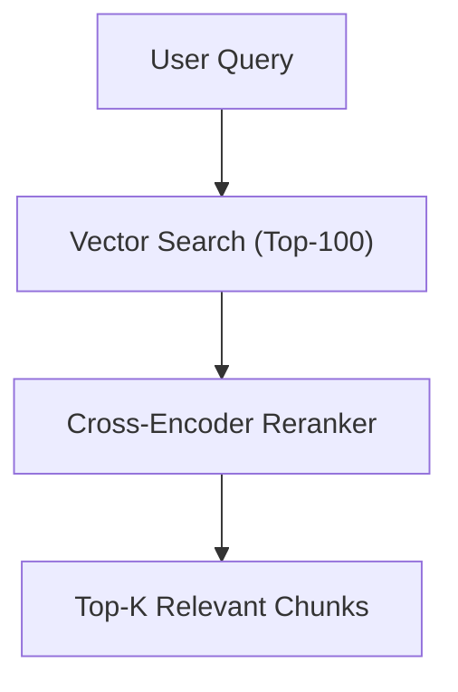

### 5. Context Injection & Prompt Engineering Flow
The strategic assembly of retrieved document chunks into optimized LLM prompt templates to maximize factual grounding.

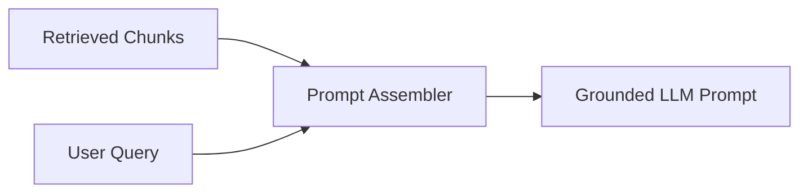

### 6. Vector DB Synchronization & Lifecycle
Ensuring the vector index remains in-sync with source data changes through real-time Change Data Capture (CDC) pipelines.

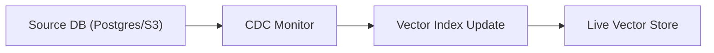

### 7. Institutional AI Scorecard
Measuring RAG performance across key institutional metrics: Faithfulness (Accuracy), Relevance, and Latency.

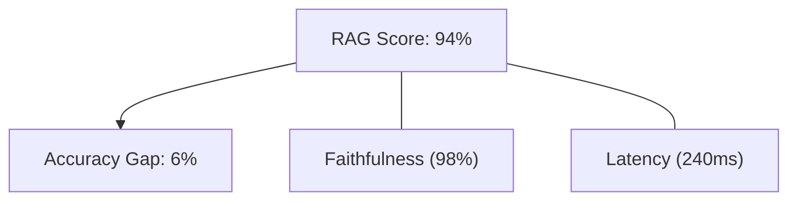

### 8. Identity & RBAC for AI Access (ACLs)
Managing fine-grained retrieval permissions to ensure users only access document chunks they are authorized to view.

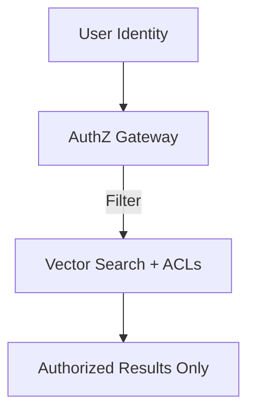

### 9. Compliance & Privacy Filter (PII)
Automatically detecting and redacting Personally Identifiable Information (PII) before it enters the embedding or retrieval cycle.

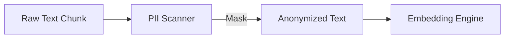

### 10. IaC Deployment: RAG-as-Code Framework
Using Terraform to deploy and manage the versioned distribution of the RAG infrastructure, including vector databases and API gateways.

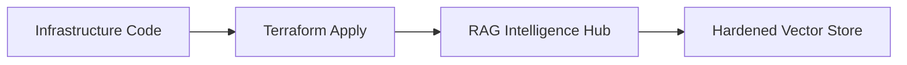

### 11. Metadata Lake for Forensic RAG Audit
Storing long-term records of every query, retrieved source, and generated response for hallucination investigation and audit.

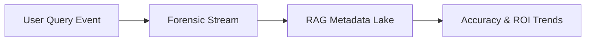

---

## 🏛️ Core AI Pillars

1.  **Scalable Ingestion Pipeline**: High-throughput processing of diverse document formats with semantic metadata enrichment.
2.  **High-Performance Vector Store**: Sub-millisecond similarity search using optimized indices and namespaced isolation.
3.  **Advanced Retrieval Strategies**: Hybrid search patterns (Keyword + Semantic) with multi-stage ranking and reranking.
4.  **Context-Aware Generation**: Strategic prompt engineering that injects authoritative context to eliminate hallucinations.
5.  **RAG Evaluation Framework**: Systematic scoring of retrieval precision, context relevance, and answer faithfulness.
6.  **AI Observability**: Deep visibility into pipeline latency, token consumption, and retrieval accuracy for continuous tuning.

---

## 🛠️ Technical Stack & Implementation

### RAG Engine & APIs
*   **Framework**: Python 3.11+ / FastAPI.
*   **Vector Engine**: In-memory optimized vector index with Cosine Similarity support for rapid retrieval.
*   **Chunking Logic**: Semantic-aware chunking with recursive character splitting for high-fidelity context.
*   **Orchestration**: Custom RAG-chain management for multi-stage retrieval and re-ranking.
*   **State Management**: PostgreSQL (Metadata Lake) and Redis (Semantic Cache).

### RAG Dashboard (UI)
*   **Framework**: React 18 / Vite.
*   **Theme**: Dark Emerald / Indigo (AI Systems aesthetic).
*   **Visualization**: Recharts for accuracy tracking, retrieval latency, and hallucination metrics.

### Infrastructure & DevOps
*   **Runtime**: AWS EKS or Azure Kubernetes Service (AKS).
*   **IaC**: Modular Terraform for deploying the RAG hub and vector store distributions.

---

## 🏗️ IaC Mapping (Module Structure)

| Module | Purpose | Real Services |
| :--- | :--- | :--- |
| **`infrastructure/rag_hub`** | Central management plane | EKS, PostgreSQL, Redis |
| **`infrastructure/vectors`** | Vector storage and indexing | Pinecone, Milvus, Weaviate |
| **`infrastructure/ingestion`** | Multi-modal data connectors | AWS Glue, Airbyte, Unstructured |
| **`infrastructure/auditing`** | Forensic AI decision sinks | S3, Athena, Quicksight |

---

## 🚀 Deployment Guide

### Local Principal Environment
```bash
# Clone the RAG platform
git clone https://github.com/devopstrio/rag-reference-architecture.git
cd rag-reference-architecture

# Configure environment
cp .env.example .env

# Launch the RAG stack
make up

# Run a sample RAG query simulation
make query-rag
```

Access the RAG Dashboard at `http://localhost:3000`.

---

## 📜 License
Distributed under the MIT License. See `LICENSE` for more information.

---
<div align="center">
  <p>© 2026 Devopstrio. All rights reserved.</p>
</div>
