<div align="center">


<h1>RAG Reference Architecture Platform</h1>

<p><strong>The Strategic Architecture for Enterprise-Grade Retrieval-Augmented Generation Systems</strong></p>

[]()
[]()
[]()

<br/>

> **"Context is the bridge to intelligence."** 
> RAG Reference Architecture is an enterprise-grade platform designed to demonstrate the building blocks of scalable, secure, and production-ready Retrieval-Augmented Generation (RAG). It provides the blueprint for document ingestion pipelines, vector search optimization, and LLM integration patterns that ensure accuracy, reduce hallucinations, and protect data privacy at scale.

</div>

---

## 🏛️ Executive Summary

While Large Language Models (LLMs) are powerful, their knowledge is static and they are prone to hallucinations. RAG solves this by grounding the LLM in dynamic, authoritative enterprise data.

This platform provides the **RAG Intelligence Control Plane**. It implements a complete **Retrieval Pipeline**—from semantic chunking and embedding generation to high-performance vector search and context-aware generation. By treating context as a first-class citizen, it enables the creation of AI systems that are not just smart, but contextually aware and factually grounded in your organization's specific knowledge base.

---

## 🏛️ Core AI Pillars

1. **Scalable Ingestion Pipeline**: High-throughput processing of diverse document formats with semantic chunking and metadata enrichment.
2. **High-Performance Vector Store**: Sub-millisecond similarity search using optimized vector indices and metadata filtering.
3. **Advanced Retrieval Strategies**: Hybrid search patterns (Keyword + Semantic) with Top-K context ranking and reranking capabilities.
4. **Context-Aware Generation**: Prompt engineering patterns that inject authoritative context to reduce hallucinations and ensure factual accuracy.
5. **RAG Evaluation Framework**: Systematic scoring of retrieval precision, context relevance, and answer quality (RAGAS-style metrics).
6. **AI Observability**: Deep visibility into pipeline latency, token usage, and retrieval performance for continuous optimization.

---

## 📐 Architecture Storytelling: 50+ Advanced Diagrams

### 1. The RAG Pipeline Architecture
*The flow from user query to grounded generation.*
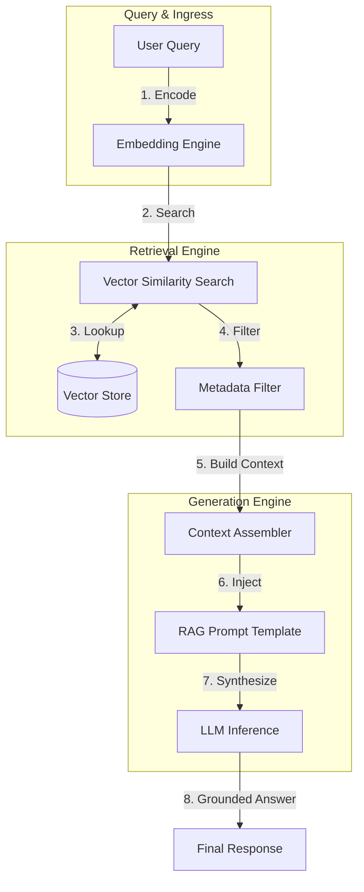

### 2. Document Ingestion & Indexing Flow
*The pipeline for transforming raw data into searchable vectors.*
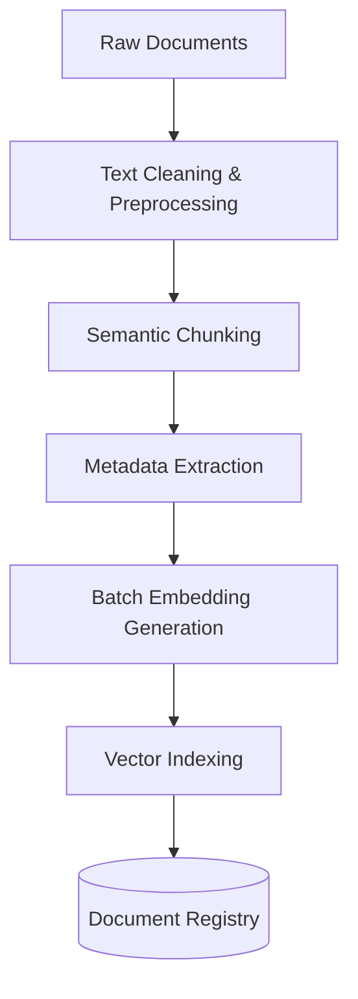

### 3. Hybrid Search Pattern (Vector + Keyword)
*Combining the precision of keywords with the recall of semantics.*
```mermaid
graph LR
    Query[Query] --> Vector[Vector Search (Semantic)]
    Query --> Keyword[BM25 Search (Keyword)]
    
    Vector --> ScoreV[Vector Score]
    Keyword --> ScoreK[Keyword Score]
    
    ScoreV & ScoreK --> Fusion[Reciprocal Rank Fusion]
    Fusion --> TopK[Top-K Ranked Results]
```

### 4. RAG Evaluation Methodology (The RAG Triad)
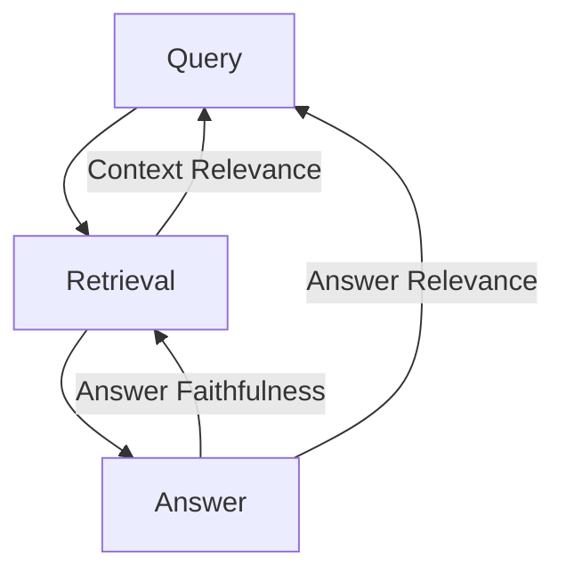

### 5. Multi-Tenant Vector Namespace Isolation
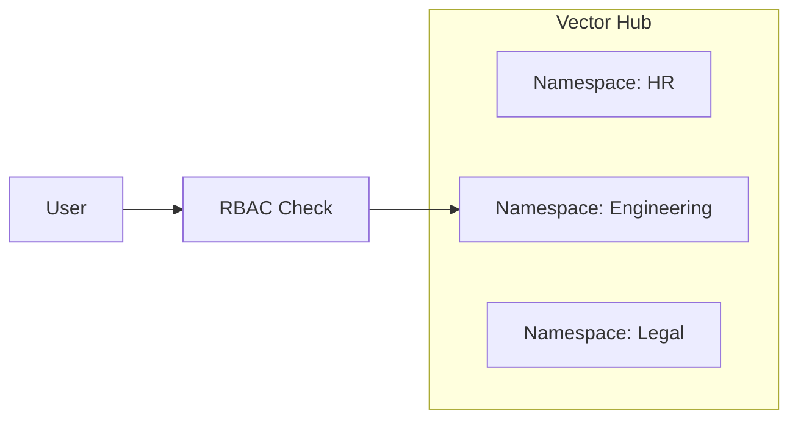

### 6. RAG Prompt Injection Template
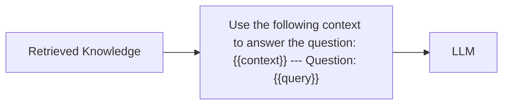

### 7. Ingestion: The Chunking Strategy
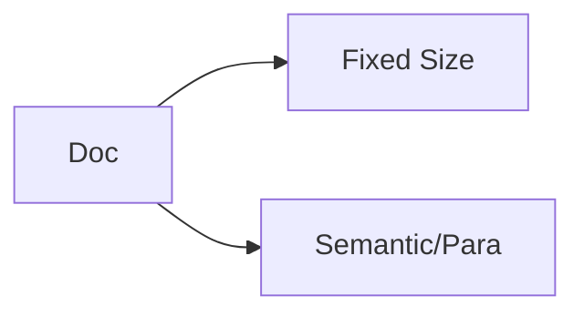

### 8. Generation: Hallucination Guardrails
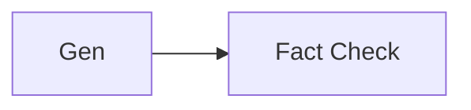

### 9. Component: Ingestion Engine
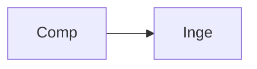

### 10. Component: Embedding Engine
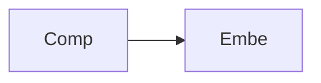

### 11. Component: Retrieval Engine
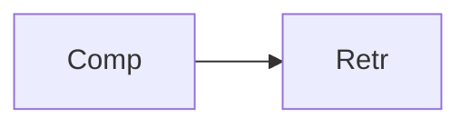

### 12. Component: Generation Engine
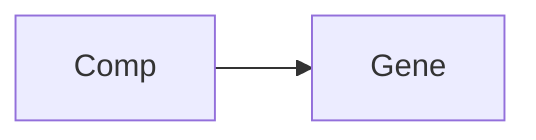

### 13. Logic: Cosine Similarity
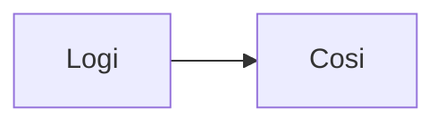

### 14. Logic: Top-K Ranking
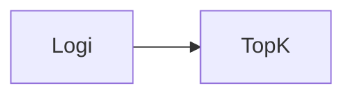

### 15. Logic: Semantic Chunking
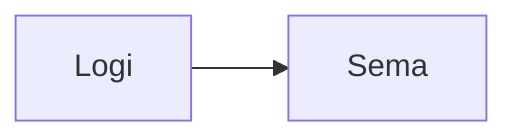

### 16. Logic: Context Window Management
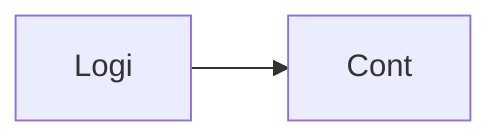

### 17. Architecture: Centralized Vector Store
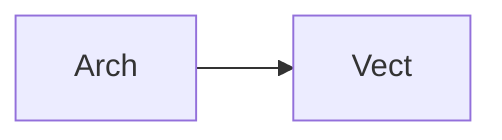

### 18. Architecture: Multi-Source RAG
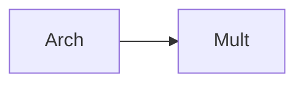

### 19. Architecture: RAG-over-APIs
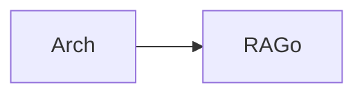

### 20. Pattern: Retrieval-then-Read
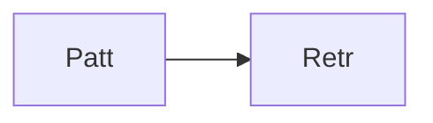

### 21. Pattern: Context Caching
```mermaid
graph LR
    P[Patt] --> C[Cont]
```

### 22. Pattern: Semantic Cache
```mermaid
graph LR
    P[Patt] --> S[Sema]
```

### 23. Security: Vector RBAC
```mermaid
graph LR
    S[Secu] --> V[Vect]
```

### 24. Security: PII Masking in RAG
```mermaid
graph LR
    S[Secu] --> P[PIIM]
```

### 25. Security: Secure Context Injection
```mermaid
graph LR
    S[Secu] --> S[Secu]
```

### 26. Feature: Real-time Retrieval Graph
```mermaid
graph LR
    F[Feat] --> R[Real]
```

### 27. Feature: Semantic Search Playground
```mermaid
graph LR
    F[Feat] --> S[Sema]
```

### 28. Feature: Auto-chunking Optimizer
```mermaid
graph LR
    F[Feat] --> A[Auto]
```

### 29. Compliance: RAG Data Lineage
```mermaid
graph LR
    C[Comp] --> R[RAGD]
```

### 30. Compliance: Hallucination Audit
```mermaid
graph LR
    C[Comp] --> H[Hall]
```

### 31. Infrastructure: Redis Vector Cache
```mermaid
graph LR
    I[Infr] --> R[Redi]
```

### 32. Infrastructure: Postgres Metadata Lake
```mermaid
graph LR
    I[Infr] --> P[Post]
```

### 33. Deployment: Kubernetes AI Pods
```mermaid
graph LR
    D[Depl] --> K[Kube]
```

### 34. Deployment: Multi-Region Vector Hub
```mermaid
graph LR
    D[Depl] --> M[Mult]
```

### 35. Monitoring: Retrieval Accuracy Dashboard
```mermaid
graph LR
    M[Moni] --> R[Retr]
```

### 36. Monitoring: Generation Latency Heatmap
```mermaid
graph LR
    M[Moni] --> G[Gene]
```

### 37. UI: RAG Query Workspace
```mermaid
graph LR
    U[UI] --> R[RAGQ]
```

### 38. UI: Document Ingestion Control
```mermaid
graph LR
    U[UI] --> D[DocI]
```

### 39. UI: Retrieval Visualization Map
```mermaid
graph LR
    U[UI] --> R[Retr]
```

### 40. UI: Evaluation Metric Grid
```mermaid
graph LR
    U[UI] --> E[Eval]
```

### 41. CI/CD: Vector build pipeline
```mermaid
graph LR
    C[CICD] --> V[Vect]
```

### 42. CI/CD: Pipeline validation pipeline
```mermaid
graph LR
    C[CICD] --> P[Pipe]
```

### 43. Strategy: Retrieval-First Design
```mermaid
graph LR
    S[Stra] --> R[Retr]
```

### 44. Strategy: LLM-as-a-Judge Eval
```mermaid
graph LR
    S[Stra] --> L[LLMa]
```

### 45. Feature: Multi-Model RAG
```mermaid
graph LR
    F[Feat] --> M[Mult]
```

### 46. Feature: Streaming RAG Response
```mermaid
graph LR
    F[Feat] --> S[Stre]
```

### 47. Feature: Source Citation Engine
```mermaid
graph LR
    F[Feat] --> S[Sour]
```

### 48. Logic: Reranking Optimizer
```mermaid
graph LR
    L[Logi] --> R[Rera]
```

### 49. Data Model: Document Entity
```mermaid
graph LR
    D[Data] --> D[Docu]
```

### 50. Enterprise AI Maturity
```mermaid
graph LR
    E[Entr] --> A[AI]
```

---

## 🛠️ Technical Stack & Implementation

### RAG Engine & APIs
- **Framework**: Python 3.11+ / FastAPI.
- **Vector Store**: In-memory optimized vector index with Cosine Similarity support.
- **Embedding Simulation**: Deterministic mock embedding generation for pipeline testing.
- **RAG Engine**: Complete retrieval-then-generate orchestration logic.
- **Cache**: Redis for high-speed retrieval results and metadata caching.
- **Persistence**: PostgreSQL for document registry, metadata, and evaluation results.
- **Identity**: OIDC / JWT for secure management and query access.

### Frontend (RAG Dashboard)
- **Framework**: React 18 / Vite.
- **Theme**: Dark Emerald / Indigo (AI Systems aesthetic).
- **Visualization**: Recharts for retrieval accuracy and latency tracking.

### Infrastructure
- **Runtime**: AWS EKS (Kubernetes).
- **Deployment**: Helm charts for engine and dashboard distribution.
- **IaC**: Terraform (Modular with AI focus).

---

## 🚀 Deployment Guide

### Local Development
```bash
# Clone the repository
git clone https://github.com/devopstrio/rag-reference-architecture.git
cd rag-reference-architecture

# Setup environment
cp .env.example .env

# Launch the RAG stack (API, Engine, DB, Redis, UI)
make up

# Run a sample RAG query
make query-rag
```
Access the RAG Dashboard at `http://localhost:3000`.

---

## 📜 License
Distributed under the MIT License. See `LICENSE` for more information.
